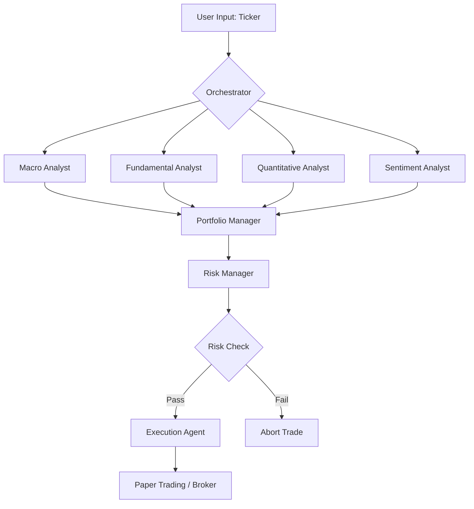

```markdown
# 🤖 Autonomous Hedge Fund: A Multi-Agent Trading System


## 📖 Overview

This project is an experimental **Multi-Agent Hedge Fund** designed to automate the workflow of an investment firm. It leverages Large Language Models (LLMs) and specialized financial data tools to analyze market conditions, assess risk, and execute trades autonomously.

The system simulates a real "Pod" structure found in hedge funds, where distinct agents (Analysts, Risk Managers, and a Portfolio Manager) collaborate to make informed trading decisions.

> **Note:** This project is currently under active development as part of a structured 3-month roadmap (March 2026 - June 2026).

## 🏛️ Architecture

The system operates on a hierarchical process:

1.  **Data Layer:** Uses `OpenBB` to fetch real-time market, fundamental, and macro data.
2.  **Analyst Layer:** Specialized agents perform distinct analysis types (Fundamental, Macro, Quantitative, Sentiment).
3.  **Decision Layer:** A Portfolio Manager (PM) synthesizes analyst reports into a trading decision.
4.  **Execution Layer:** A Risk Manager validates the trade, and execution tools place orders via `Alpaca`.



## 🤖 The Agents

| Agent | Role | Tools Used |
| :--- | :--- | :--- |
| **Macroeconomic Analyst** | Analyzes global economic trends, interest rates, and yield curves. | OpenBB (FRED), Yield Curve Tools |
| **Fundamental Analyst** | Evaluates company financials, valuation (P/E, PEG), and growth. | OpenBB (Financials), Income Statement Tools |
| **Quantitative Analyst** | Identifies technical patterns and momentum signals. | RSI, MACD, Historical Price Tools |
| **Sentiment Analyst** | Scrapes news and aggregates sentiment scores. | OpenBB (News), Sentiment Analysis |
| **Risk Manager** | Monitors position sizing and exposure limits. | Risk Calculation Tools |
| **Portfolio Manager** | The decision-maker. Synthesizes inputs to generate trade orders. | None (Reasoning only) |

## 🛠️ Tech Stack

-   **Core Language:** Python 3.10+
-   **Agent Frameworks:** `CrewAI`, `LangChain`, `LangGraph`
-   **Data Provider:** `OpenBB` (Open Source Investment Research)
-   **Execution:** `Alpaca-trade-api` (Paper Trading)
-   **Analysis:** `Pandas`, `NumPy`, `TA-Lib`

## 📂 Project Structure

```text
quant-agent-fund/
├── .env                # API Keys and Secrets
├── requirements.txt    # Python Dependencies
├── main.py             # Entry point for the crew
├── src/
│   ├── agents/         # Agent definitions (Personas, Prompts)
│   ├── tools/          # Custom Tools (OpenBB wrappers, Risk calc)
│   ├── crew/           # Orchestration logic (CrewAI setup)
│   └── utils/          # Helper functions (Logging, Parsing)
├── data/               # Cached data or historical logs
├── notebooks/          # Experimental analysis
└── tests/              # Unit tests for tools
```

## 🚀 Getting Started

### Prerequisites

-   Python 3.10 or higher
-   An OpenAI API Key (or other LLM provider)
-   Alpaca Paper Trading Account (for execution)

### Installation

1.  **Clone the repository:**
    ```bash
    git clone https://github.com/yourusername/quant-agent-fund.git
    cd quant-agent-fund
    ```

2.  **Set up a virtual environment:**
    ```bash
    python -m venv venv
    source venv/bin/activate  # On Windows use `venv\Scripts\activate`
    ```

3.  **Install dependencies:**
    ```bash
    pip install -r requirements.txt
    ```

4.  **Configure API Keys:**
    Create a `.env` file in the root directory and add your keys:
    ```env
    OPENAI_API_KEY=your_openai_key
    ALPACA_API_KEY=your_alpaca_key
    ALPACA_SECRET_KEY=your_alpaca_secret
    ```

### Usage

To run the analysis for a specific stock ticker:

```bash
python main.py --ticker AAPL
```

*(Note: Execution flags and specific command arguments will be implemented in Phase 4).*

## 📅 Roadmap

We are following a strict 3-month development timeline.

-   [x] **Phase 1: Infrastructure & Tech Stack Onboarding** (Mar 2026)
-   [ ] **Phase 2: Theory & Agent Development** (Mar - Apr 2026)
    -   [ ] Fundamental Analyst Implementation
    -   [ ] Macro Analyst Implementation
    -   [ ] Quantitative Analyst Implementation
-   [ ] **Phase 3: Orchestration** (Apr 2026)
    -   [ ] Portfolio Manager Logic
    -   [ ] JSON Output Parsing
-   [ ] **Phase 4: Execution & Risk** (May 2026)
    -   [ ] Risk Manager Agent
    -   [ ] Paper Trading Integration
-   [ ] **Phase 5: Polish & Deployment** (May - Jun 2026)
    -   [ ] Backtesting Engine
    -   [ ] Cloud Deployment

## 📚 Resources & Reading List

This project draws inspiration from the following texts:

1.  *Investing From the Top Down* by Anthony Crescenzi
2.  *The Little Book of Investing Like the Pros* by James O'Shaughnessy
3.  *Quantitative Strategies for Achieving Alpha* by Richard Tortoriello

## ⚠️ Disclaimer

**This project is for educational and research purposes only.**

It is not financial advice. Trading involves substantial risk of loss and is not suitable for every investor. Past performance is not indicative of future results. Always do your own research before making any investment decisions. The creators of this software are not responsible for any financial losses incurred while using this code.

## 📜 License

This project is licensed under the MIT License - see the [LICENSE](LICENSE) file for details.
```